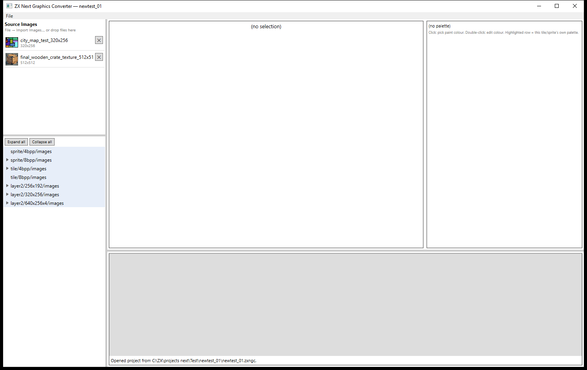
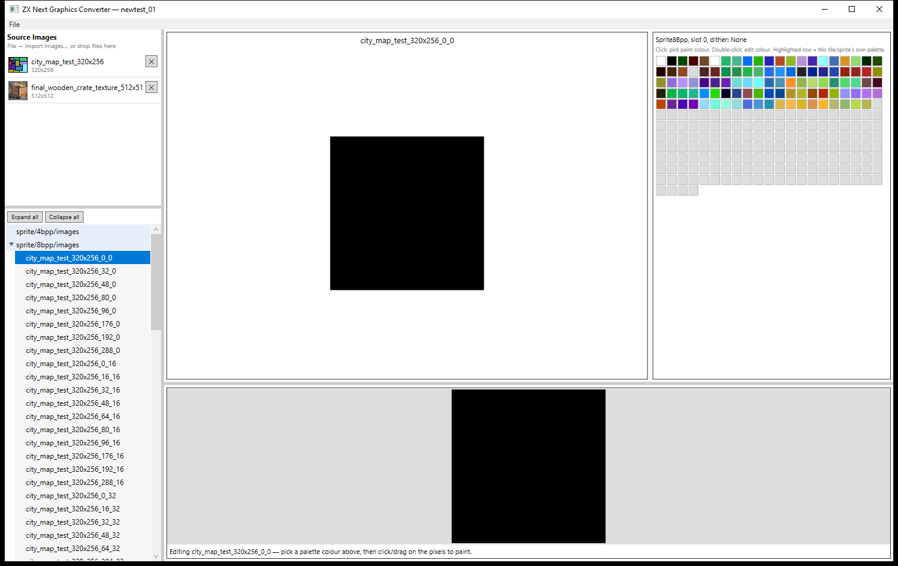

# ZX Next Graphics Converter

A Windows desktop tool (WPF, .NET 9) that converts ordinary images into native [ZX Spectrum Next](https://www.specnext.com/) graphics — sprites, tiles, and full-screen Layer2 bitmaps — with correct palette allocation, optional dithering, manual pixel/palette editing, and a ready-to-assemble Z80 export (binary chunks + an ASM address map).

> Built with [Claude Code](https://claude.com/claude-code) using the Claude Sonnet 5 model.

## Screenshots

Project tree, source-image library, and the drag-and-drop workflow:



Editing a converted sprite: pixel canvas, its own palette highlighted in the folder's shared palette strip, and the tree showing hundreds of auto-sliced sprites from one dropped source image:



## Features

- **Import**: drag-and-drop a source image onto a category folder, or `File → Import Images...`. An image larger than the target cell size opens an atlas-slicer dialog (grid overlay, offset/spacing controls, duplicate-cell skipping) instead of failing.
- **Asset categories**, each with its own cell size and palette model:

  | Category | Cell size | Palette model |
  |---|---|---|
  | Sprite 4bpp / Tile 4bpp | 16×16 / 8×8 | Shared 16-slot palette bank (15 usable colours/slot), auto-allocated across all tiles/sprites in the category |
  | Sprite 8bpp / Tile 8bpp | 16×16 / 8×8 | One flat 256-colour palette per folder (user-created sub-folders get their own) |
  | Layer2 256×192 / 320×256 | full screen | One flat 256-colour palette per folder |
  | Layer2 640×256×4 | full screen | One flat 16-colour palette per folder |

- **Colour matching**: pixels are matched against the real Next-512 colour space (3 bits/channel), with a choice of dithering per source image — None, Ordered Bayer 4×4, or Floyd–Steinberg error diffusion (whole-image, so slicing into tiles later never creates dithering seams).
- **4bpp palette allocation**: a real bucketing algorithm (subset-match an existing slot → merge into the slot needing fewest new colours → allocate a new slot → report overflow), plus an "Optimize bank" pass that repacks everything into as few slots as possible without changing any colour.
- **Editing**: click-to-paint pixel editor and a genuine 512-colour picker (no snapping surprises — every colour shown is a real, selectable Next colour), palette-bank overview grid, eyedropper (Ctrl+click), single-level undo.
- **Bulk operations**: Ctrl/Shift-click multi-select in the project tree; re-quantize a single tile, an entire folder, or the current multi-selection with a different dithering mode; changing dithering on a source image re-quantizes every placement of it immediately.
- **Projects**: saved as a single `.zxngc` file (a zip of the manifest + source images + converted asset data); recent-projects list; auto-opens the last project on launch; unsaved-changes tracking with a save-before-closing prompt.
- **Export for Next**: packs every folder's assets into 8KB banks (never splitting one asset across a bank boundary) and emits matching Z80 ASM:

  ```asm
  slot_000: equ 0
  slot_001: equ 1

  hero_walk_00:
      db slot_000 ; 8KB bank
      db 3        ; 4bpp palette index (0-15) — 4bpp assets only
      dw 128       ; byte offset within the bank
  ```

## Getting started

Requirements: Windows, [.NET 9 SDK](https://dotnet.microsoft.com/download).

```powershell
# Build everything
dotnet build ZxNextGraphicsConverter.sln

# Run the app
dotnet run --project src/ZxNext.App

# Run the Core test suite
dotnet test tests/ZxNext.Core.Tests
```

## Project structure

```
src/ZxNext.Core/    Conversion, quantization, palette allocation, project persistence, export — plain C#, no UI/WPF dependency
src/ZxNext.App/     WPF UI (MVVM, CommunityToolkit.Mvvm) — views, view models, dialogs
tests/ZxNext.Core.Tests/   xUnit tests over ZxNext.Core
```

`ZxNext.Core` is deliberately UI-agnostic — every conversion, palette, and export decision lives there and is unit-tested independently of WPF.

## License

[MIT](LICENSE)
