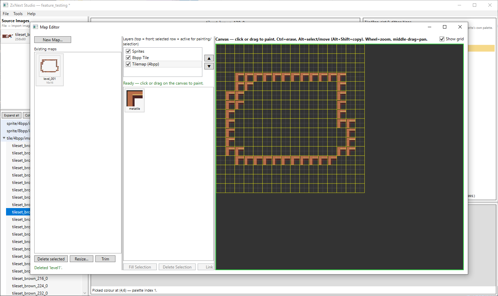
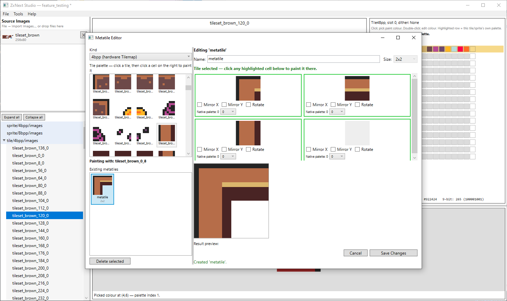
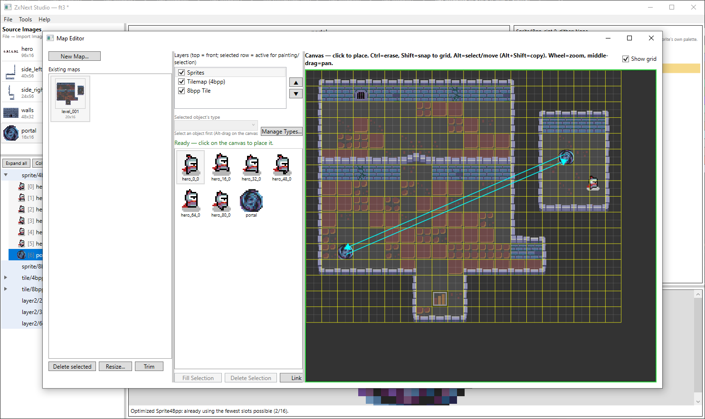
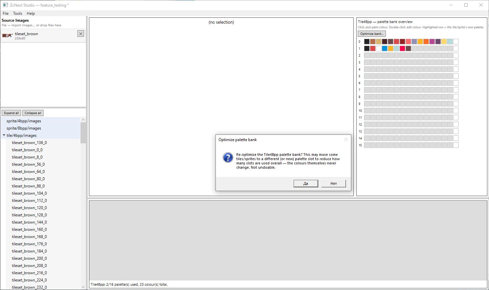
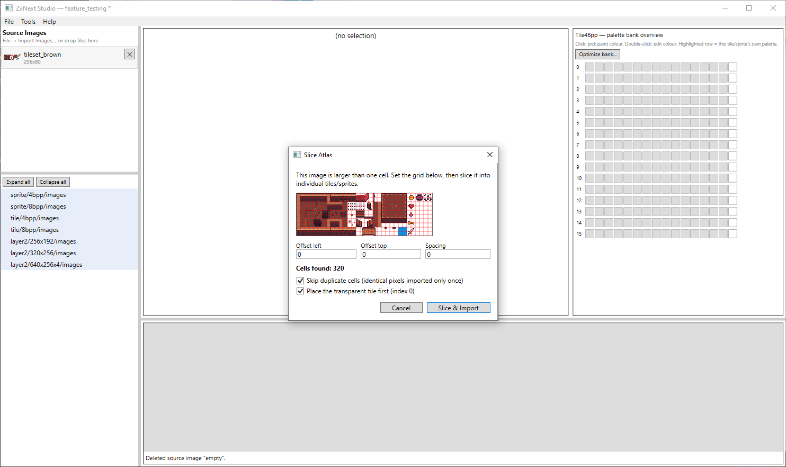
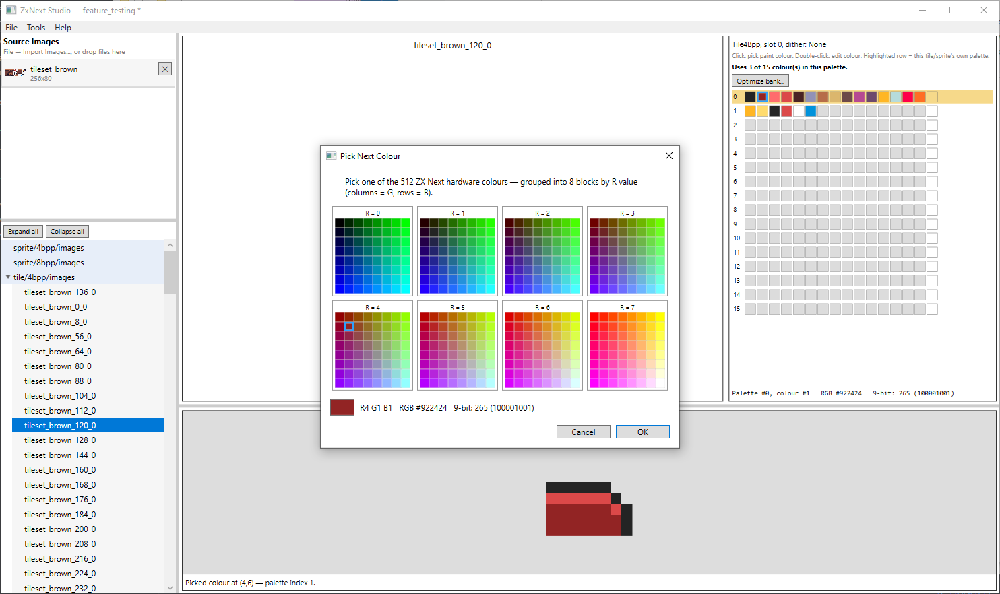

# ZxNext Studio

A Windows desktop tool (WPF, .NET 9) that converts ordinary images into native [ZX Spectrum Next](https://www.specnext.com/) graphics — sprites, tiles, full-screen Layer2 bitmaps, and tile-based maps with typed, linkable objects — with correct palette allocation, optional dithering, manual pixel/palette editing, and a ready-to-assemble Z80 export.

> Built with [Claude Code](https://claude.com/claude-code) using the Claude Sonnet 5 model.

## Screenshots

Painting a map across the Tilemap/8bpp-Tile/Sprite layers, with a metatile selected for painting:



The Metatile Editor: composing a reusable 2x2 block from individual tiles, with per-cell mirror/rotate:



Two placed objects linked with a directed arrow (e.g. a switch tied to a specific door):



The 4bpp palette-bank overview, with "Optimize bank" about to repack tiles into fewer slots:



Slicing an oversized source image into individual 4bpp tiles, with duplicate-cell skipping:



The genuine 512-colour Next picker, grouped into 8 blocks by R value:



## Demo

[ZxNextStudio-TechDemo](https://github.com/serdjukdev/ZxNextStudio-TechDemo) is a small ZX Spectrum Next tech demo built entirely from data exported here: all three layer types (Tilemap, Layer2, Sprites) rendered at once, animated player movement, wall collision, and a portal that teleports the player via an object link.

## Features

- **Import**: drag-and-drop a source image onto a category folder, or `File → Import Images...`. An image larger than the target cell size opens an atlas-slicer dialog (grid overlay, offset/spacing controls, duplicate-cell skipping) instead of failing. For tile categories, the slicer can also cut straight into the project's metatile blocks (16×16/24×24/32×32, matching the fixed metatile size) — each block's tiles are imported with duplicates reused, and a metatile is auto-built from the result.
- **Asset categories**, each with its own cell size and palette model:

  | Category | Cell size | Palette model |
  |---|---|---|
  | Sprite 4bpp / Tile 4bpp | 16×16 / 8×8 | Shared 16-slot palette bank (15 usable colours/slot), auto-allocated across all tiles/sprites in the category |
  | Sprite 8bpp / Tile 8bpp | 16×16 / 8×8 | One flat 256-colour palette per folder (user-created sub-folders get their own) |
  | Layer2 256×192 / 320×256 | full screen | One flat 256-colour palette per folder |
  | Layer2 640×256×4 | full screen | One flat 16-colour palette per folder |

- **Colour matching**: pixels are matched against the real Next-512 colour space (3 bits/channel), with a choice of dithering per source image: None, Ordered Bayer 4×4, or Floyd-Steinberg error diffusion (whole-image, so slicing into tiles later never creates dithering seams).
- **4bpp palette allocation**: a real bucketing algorithm (subset-match an existing slot, then merge into the slot needing fewest new colours, then allocate a new slot, else report overflow), plus an "Optimize bank" pass that repacks everything into as few slots as possible without changing any colour.
- **Editing**: click-to-paint pixel editor and a genuine 512-colour picker (no snapping surprises: every colour shown is a real, selectable Next colour), palette-bank overview grid, eyedropper (Ctrl+click in the editable canvas, plain click/drag in the read-only preview above it), a full per-window undo stack.
- **Project tree**: full-row click selection, Ctrl/Shift-click multi-select, right-click bulk delete/re-quantize on a whole selection. Every tile/sprite row shows a live thumbnail of its own pixels and its real export index (the exact number that ends up in the exported file); drag one row onto another to reorder it and renumber the category to match.
- **Bulk operations**: re-quantize a single tile, an entire folder, or the current multi-selection with a different dithering mode; changing dithering on a source image re-quantizes every placement of it immediately.
- **Metatile Editor**: compose reusable blocks of tiles (2×2/3×3/4×4 — one fixed size per project, chosen once), with per-cell mirror/rotate and an optional palette-slot override — the placeable unit on a map's grid layers. Drag one metatile onto another to reorder it; every map placing an affected metatile is rewritten to match automatically. A "Blank" tile and metatile are auto-generated and always sit at export index 0, undeletable — a real tile pattern for an unpainted/erased map cell to reference, so hardware code never reads past the end of the metatile table or leaves stale VRAM content behind.
- **Map Editor**: paint maps across two metatile grid layers (4bpp Tilemap, 8bpp Tile) plus a freeform Sprite object layer, with modifier-driven tools (plain paint, Ctrl-erase, Shift-snap sprite placement, Alt select/move/copy) and Resize/Trim. Rendering is cached and incremental, so painting stays responsive even on maps with tens of thousands of cells.
- **Object types, links & user byte**: give any placed object a user-defined type (e.g. "portal", "character"), draw a directed link between two objects (e.g. a button that opens a specific door, shown as an arrow on the canvas), and set a free-form 0-255 user byte (edited as a number or its 8 individual bits, either one updates the other) for whatever a game's own code needs it for. All three are exported as extra bytes per object.
- **Projects**: saved as a single `.zxngc` file (a zip of the manifest, source images, and converted asset data); recent-projects list; auto-opens the last project on launch; unsaved-changes tracking with a save-before-closing prompt.
- **Export for Next**: every asset folder (or, for Layer2, each image) packs into binary chunks plus a matching Z80 ASM address map, with a per-row choice of chunk size (8KB/16KB/whole file) and, for software-blitted Tile8Bpp assets, row-major vs column-major pixel order. Each map exports separately — grid layers, metatiles, and objects embedded directly as `db` bytes, no chunking — plus one project-wide `object_types.asm` shared by every map. The export dialog previews every row live before you commit.
- **Help**: an in-app Help screen (Help menu or F1) documenting every button, shortcut, and export byte format.

## Getting started

Requirements: Windows, [.NET 9 SDK](https://dotnet.microsoft.com/download).

Prefer not to build from source? The [Releases](https://github.com/serdjukdev/ZxNextGraphicsConverter/releases) page has ready-to-run Windows builds plus a sample `.zxngc` project you can open right away.

```powershell
# Build everything
dotnet build ZxNextGraphicsConverter.sln

# Run the app
dotnet run --project src/ZxNext.App

# Run the Core test suite
dotnet test tests/ZxNext.Core.Tests
```

## Project structure

```
src/ZxNext.Core/    Conversion, quantization, palette allocation, project persistence, export. Plain C#, no UI/WPF dependency.
src/ZxNext.App/     WPF UI (MVVM, CommunityToolkit.Mvvm): views, view models, dialogs.
tests/ZxNext.Core.Tests/   xUnit tests over ZxNext.Core.
```

`ZxNext.Core` is deliberately UI-agnostic: every conversion, palette, and export decision lives there and is unit-tested independently of WPF.

## Support

If you find this useful, you can support its development on [Patreon](https://www.patreon.com/cw/Serdjuk) or [Ko-fi](https://ko-fi.com/serdjuk).

## License

[PolyForm Noncommercial 1.0.0](LICENSE) — free to use, modify, and share for noncommercial purposes; commercial use (including selling this software or a derivative of it) is not permitted without a separate agreement with the author.
